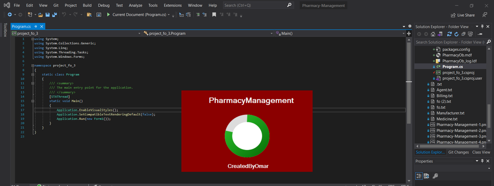
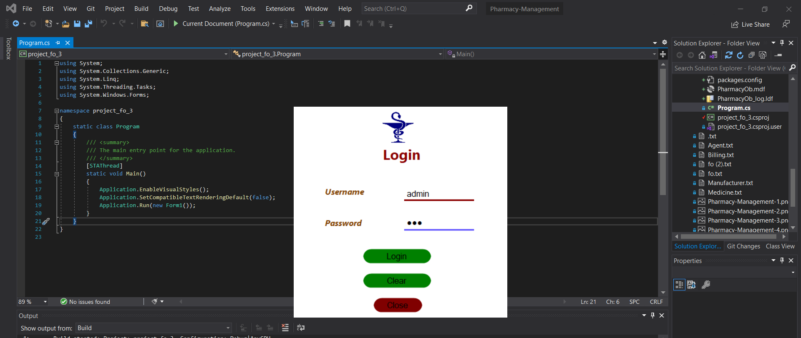
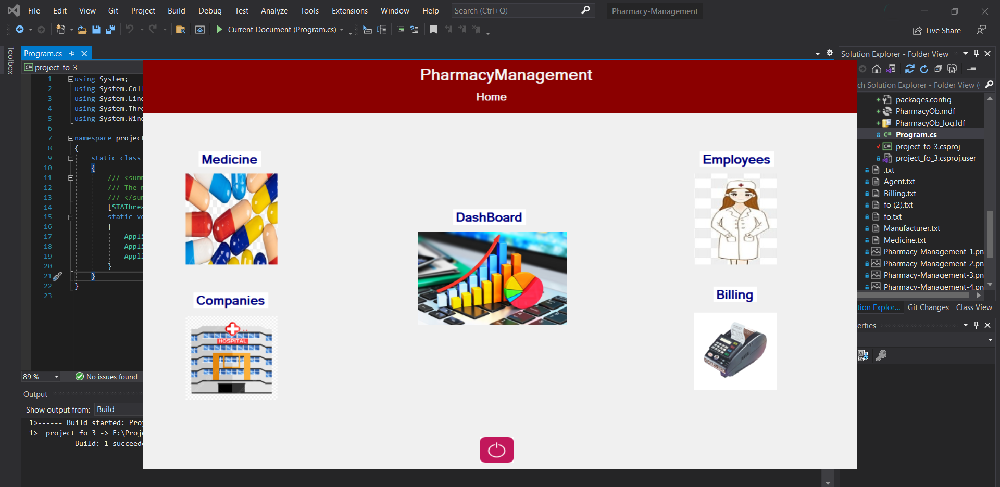
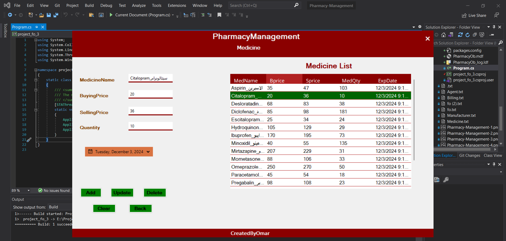
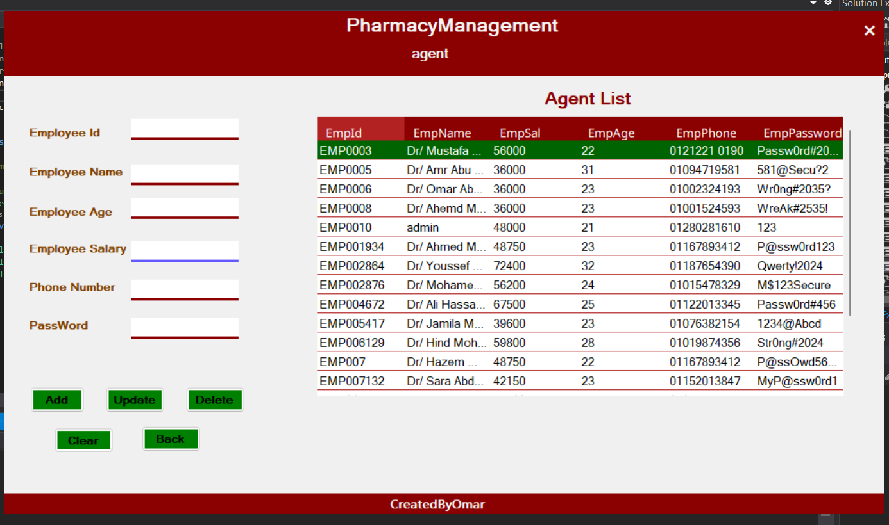
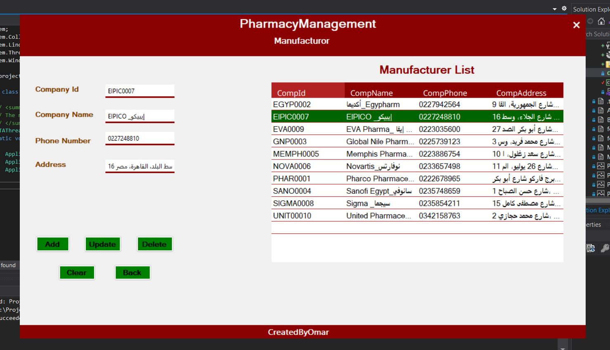
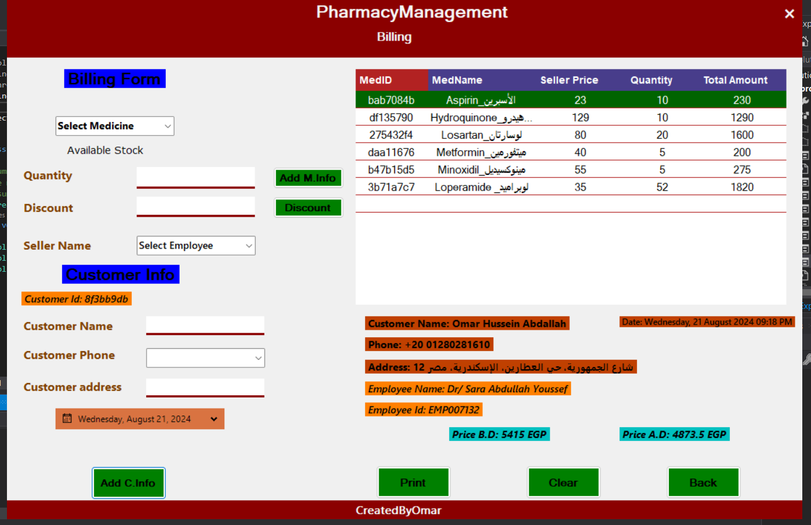
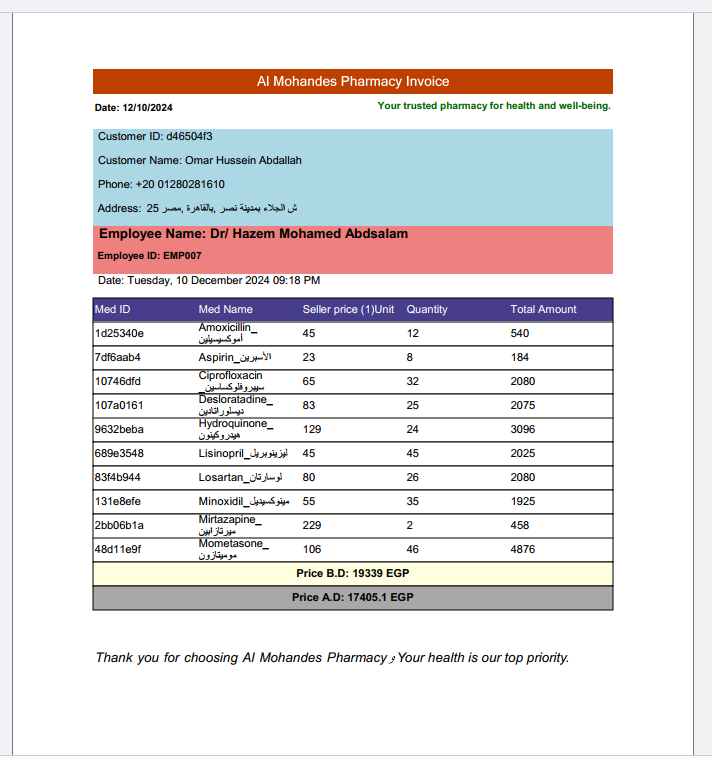
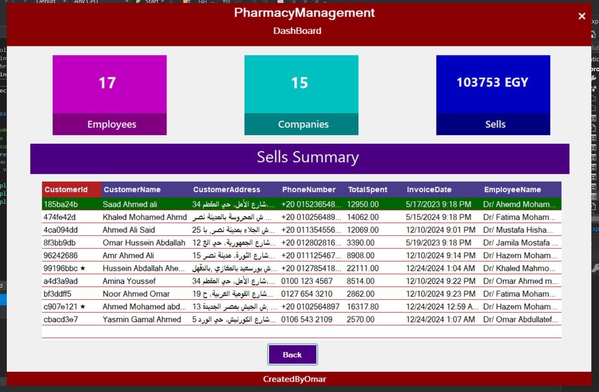

<div align="center">

# 💊🏥 Pharmacy Management System

<p>
  <table>
    <tr>
      <td></td>
      <td></td>
      <td></td>
    </tr>
    <tr>
      <td></td>
      <td></td>
      <td></td>
    </tr>
    <tr>
      <td></td>
      <td></td>
      <td></td>
    </tr>
  </table>
  <br>
  <b>Pharmacy Management</b>: نظام إدارة صيدلية شامل مبني بـ C# لإدارة العمليات اليومية، المخزون، والفواتير بكفاءة عالية. 💊📊
  <br>

[ Pharmacy Management Demo](https://omarrsakr.github.io/Pharmacy-Management/) •
[Documentation](https://github.com/OmarrSakr/Pharmacy-Management/wiki) •
[Report Issues](https://github.com/OmarrSakr/Pharmacy-Management/issues)

</p>
<br>

**`Pharmacy Management System`** is a comprehensive desktop application built with **`C# Windows Forms`** designed to streamline pharmacy operations. It features multiple integrated modules for **employee management**, **billing systems**, **medicine inventory tracking**, and **manufacturer records** with secure data handling through file storage and database connectivity.


</div>

<div align="center">

<p align="center">

## 📊 Project Stats

- 💊 **Modules**: 4 Core Management Systems
- 🏥 **Target**: Pharmacy & Healthcare Facilities
- 💻 **Platform**: Windows Desktop Application
- ⭐ **Rating**: 4.6/5 (based on healthcare professionals feedback)
- 🌐 **Visitors**: 

</p>

---

## 🧑‍💻 Tech Stack

<p>
  
  
  
  
  
  
  
</p>

---

## 📷 Screenshots

<table>
  <tr>
    <td></td>
    <td></td>
    <td></td>
  </tr>
  <tr>
    <td></td>
    <td></td>
    <td></td>
  </tr>
  <tr>
    <td></td>
    <td></td>
    <td></td>
  </tr>
</table>
</div>

---

## 📑 Table of Contents

- [🚀 Features](#-features)
- [🧑‍💻 Technologies Used](#-technologies-used)
- [📂 Project Structure](#-project-structure)
- [🔧 Installation](#-installation)
- [⚙️ Usage](#️-usage)
- [🔑 Login Information](#-login-information)
- [💾 Database Configuration](#-database-configuration)
- [📊 System Modules](#-system-modules)
- [🔒 Security Features](#-security-features)
- [📌 Future Enhancements](#-future-enhancements)
- [⚠️ Important Notes](#️-important-notes)
- [🤝 Contributing](#-contributing)
- [📪 Feedback](#-feedback)
- [📜 License](#-license)

---
## 🌐 Live Demo

Check out the live demo of **Pharmacy Management** at 👉 [Pharmacy-Management Demo](https://omarrsakr.github.io/Pharmacy-Management/)

---

## 🚀 Features

- 👥 **Agent Management**: Complete employee records with add, search, edit, and delete functionality
- 💰 **Billing System**: Comprehensive transaction recording with detailed bill generation
- 💊 **Medicine Inventory**: Advanced stock tracking with batch, expiry, and pricing management
- 🏭 **Manufacturer Management**: Detailed supplier records and communication tracking
- 🔐 **Secure Authentication**: Login system with credential protection
- 📊 **Data Persistence**: File-based storage with database integration
- 🖥️ **Desktop Optimized**: Responsive Windows Forms interface
- 🔍 **Advanced Search**: Quick data retrieval across all modules
- 📈 **Financial Tracking**: Enhanced billing and transaction monitoring
- ⚡ **Real-time Updates**: Instant data synchronization across modules

---

## 🧑‍💻 Technologies Used

- **C# Windows Forms**: Core application framework for user interface development
- **.NET Framework**: Runtime environment and base class library
- **SQL Server LocalDB**: Local database engine for data storage
- **File Handling**: Text file operations for data persistence and backup
- **ADO.NET**: Data access technology for database connectivity
- **Visual Studio**: Integrated development environment
- **Object-Oriented Programming**: Modular design with class-based architecture

📦 **Dependencies**

- [.NET Framework 4.7.2+](https://dotnet.microsoft.com/download/dotnet-framework)
- [SQL Server LocalDB](https://docs.microsoft.com/en-us/sql/database-engine/configure-windows/sql-server-express-localdb)
- [Visual Studio 2019+](https://visualstudio.microsoft.com/) (for development)

---

## 📂 Project Structure

```
Pharmacy-Management/
├── 📁 Forms/
│   ├── 🏠 Home.cs                    # Main dashboard interface
│   ├── 👥 AgentManagement.cs         # Employee management form
│   ├── 💰 Billing.cs                 # Transaction and billing form
│   ├── 💊 MedicineInventory.cs       # Medicine stock management
│   ├── 🏭 ManufacturerRecords.cs     # Supplier management form
│   └── 🔐 Login.cs                   # Authentication form
├── 📁 Data/
│   ├── 🗄️ PHARMACYOB.MDF             # SQL Server database file
│   ├── 📄 savedLogin.txt             # Login credentials backup
│   └── 📊 InventoryData.txt          # Medicine stock data
├── 📁 Models/
│   ├── 👤 Agent.cs                   # Employee data model
│   ├── 💊 Medicine.cs                # Medicine data model
│   ├── 🏭 Manufacturer.cs            # Supplier data model
│   └── 💰 Transaction.cs             # Billing data model
├── 📁 Resources/
│   ├── 🖼️ Icons/                     # Application icons
│   └── 🎨 Images/                    # UI graphics
├── 🔧 App.config                     # Application configuration
├── 📄 Program.cs                     # Application entry point
└── 📕 README.md                      # Project documentation
```

---

## 🔧 Installation

### **Prerequisites**

- Windows 10/11 (64-bit recommended)
- .NET Framework 4.7.2 or higher
- Visual Studio 2019 or later (for development)
- SQL Server LocalDB

### **Installation Steps**

1. **Clone the repository**

```bash
git clone https://github.com/OmarrSakr/Pharmacy-Management.git
```

2. **Navigate to project directory**

```bash
cd Pharmacy-Management
```

3. **Open in Visual Studio**

   - Launch Visual Studio
   - Open `PharmacyManagement.sln`

4. **Configure Database Connection**
   - Update the connection string in the code:

```csharp
public SqlConnection con = new SqlConnection(@"Data Source=(LocalDB)\MSSQLLocalDB;AttachDbFilename=E:\PROJECT_OOP\FO_ORGANIZATION\PHARMACY-MANAGEMENT\PROJECT_FO_3\PHARMACYOB.MDF;Integrated Security=True;");
```

5. **Build and Run**
   - Press `F5` or click `Start Debugging`
   - Ensure all dependencies are restored

---

## 📋 System Requirements

- **OS**: Windows 10/11
- **RAM**: 4GB minimum (8GB recommended)
- **Storage**: 500MB free space
- **Framework**: .NET Framework 4.7.2+
- **Database**: SQL Server LocalDB
- **Resolution**: 1024x768 minimum

---

## ⚙️ Usage

### **Getting Started**

1. **Launch Application**: Run the executable or start from Visual Studio
2. **Login**: Use the provided credentials (see Login Information section)
3. **Navigate Modules**: Access different management sections from the main menu
4. **Manage Data**: Add, edit, search, and delete records as needed
5. **Generate Reports**: Use billing module for transaction reports

### **Daily Operations**

- **Morning Setup**: Check inventory levels and expiring medicines
- **Customer Service**: Process sales and generate bills
- **Inventory Updates**: Add new stock and update medicine information
- **End-of-Day**: Review transactions and generate daily reports

---

## 🔑 Login Information

### **Default Credentials**

- **Username**: `admin`
- **Password**: `123`

### **Security Implementation**

```csharp
// Login validation with file backup
string filename = @"E:\Project_OOP\FO_organization\Pharmacy-Management\savedLogin.txt";
using (FileStream myfile = new FileStream(filename, FileMode.OpenOrCreate, FileAccess.Write))
{
    using (StreamWriter sw = new StreamWriter(myfile))
    {
        sw.WriteLine($"username: {username.Text}\t password:{password.Text}");
    }
}

if (name == "admin" && pass == "123")
{
    Hide();
    Home basic = new Home();
    basic.ShowDialog();
}
else
{
    MessageBox.Show("Error, your Username or Password is incorrect");
    username.Text = password.Text = null;
}
```

### **Changing Login Credentials**

To modify the default login credentials:

```csharp
// Update these values in the Login.cs file
string defaultUsername = "admin";  // Change to your preferred username
string defaultPassword = "123";    // Change to your secure password
```

**⚠️ Important**: Always use strong passwords in production environments!

---

## 💾 Database Configuration

### **Connection String Setup**

The application uses SQL Server LocalDB. Update the connection string to match your file path:

```csharp
public SqlConnection con = new SqlConnection(@"Data Source=(LocalDB)\MSSQLLocalDB;AttachDbFilename=[YOUR_PROJECT_PATH]\PHARMACYOB.MDF;Integrated Security=True;");
```

### **Database Tables**

- **Agents**: Employee information and management data
- **Medicines**: Inventory details with batch and expiry tracking
- **Manufacturers**: Supplier contact and product information
- **Transactions**: Billing and sales transaction records

---

## 📊 System Modules

### **1. Agent Management Module**

- ➕ **Add New Agents**: Complete employee registration
- 🔍 **Search & Filter**: Quick employee lookup
- ✏️ **Edit Records**: Update employee information
- 🗑️ **Delete Agents**: Remove inactive employees
- 📋 **View Details**: Comprehensive employee profiles

### **2. Billing System Module**

- 💰 **Process Sales**: Record customer transactions
- 🧾 **Generate Bills**: Create detailed invoices
- 📊 **Transaction History**: View past sales records
- 💳 **Payment Tracking**: Monitor payment methods
- 📈 **Financial Reports**: Daily/monthly sales summaries

### **3. Medicine Inventory Module**

- 💊 **Stock Management**: Track available quantities
- 📅 **Expiry Monitoring**: Alert for expiring medicines
- 🏷️ **Batch Tracking**: Manage batch numbers and dates
- 💲 **Price Management**: Update and maintain pricing
- ⚠️ **Low Stock Alerts**: Inventory threshold warnings

### **4. Manufacturer Management Module**

- 🏭 **Supplier Records**: Maintain manufacturer databases
- 📞 **Contact Information**: Store communication details
- 📦 **Product Catalog**: Track supplied medicines
- 🤝 **Relationship Management**: Supplier interaction history
- 📋 **Contract Details**: Agreement and terms tracking

---

## 🔒 Security Features

- **🔐 Authentication System**: Secure login with credential validation
- **📁 Data Backup**: Automatic file-based backup system
- **🛡️ Input Validation**: Prevent malicious data entry
- **🔒 Session Management**: Secure user session handling
- **📊 Audit Trail**: Track user activities and changes
- **⚠️ Warning System**: Alert for unauthorized access attempts

---

## 📌 Future Enhancements

- 🔐 **Enhanced Authentication**: Multi-user system with role-based access
- 🌙 **Dark Mode Theme**: Modern UI with theme switching
- 📱 **Mobile Compatibility**: Responsive design for tablets
- ☁️ **Cloud Integration**: Online backup and synchronization
- 📧 **Email Notifications**: Automated alerts and reports
- 📊 **Advanced Analytics**: Business intelligence and insights
- 🔄 **Auto-Updates**: Automatic software update system
- 🌐 **Multi-Language**: Support for Arabic and other languages
- 📤 **Data Export**: Excel and PDF report generation
- 🔔 **Smart Alerts**: AI-powered inventory predictions

---

## ⚠️ Important Notes

- **🏥 Desktop Application**: Designed specifically for Windows desktop environments
- **🗄️ Database Dependency**: Requires SQL Server LocalDB for full functionality
- **📁 File Path Critical**: Ensure correct database file path configuration
- **🔒 Credential Security**: Default login credentials should be changed in production
- **💾 Regular Backups**: Implement regular data backup procedures
- **🖥️ System Requirements**: Verify .NET Framework compatibility
- **🔧 Development Environment**: Visual Studio required for code modifications
- **📊 Data Integrity**: Always validate data before making changes

---

## 🤝 Contributing

We welcome contributions to improve the Pharmacy Management System! Here's how to contribute:

### **Getting Started**

1. **Fork the repository** - Click the "Fork" button at the top right

2. **Clone your fork**

```bash
git clone https://github.com/YourUsername/Pharmacy-Management.git
```

3. **Create a feature branch**

```bash
git checkout -b feature/your-feature-name
```

4. **Make your changes**

   - Follow C# coding standards
   - Test thoroughly on Windows environment
   - Update documentation as needed

5. **Commit your changes**

```bash
git add .
git commit -m "Add: detailed description of your changes"
```

6. **Push to your branch**

```bash
git push origin feature/your-feature-name
```

7. **Submit a Pull Request**
   - Provide clear description of changes
   - Include screenshots for UI modifications
   - Reference any related issues

### **Contribution Guidelines**

- Follow Microsoft C# coding conventions
- Include unit tests for new functionality
- Update README for new features
- Ensure backward compatibility
- Test on multiple Windows versions

---

## 📪 Feedback

💡 **Found bugs or have suggestions?**  
We value your feedback to make this system better!

**GitHub Issues**: [Report bugs or request features](https://github.com/OmarrSakr/Pharmacy-Management/issues)

**Email Contact**:
<a href="https://mail.google.com/mail/?view=cm&fs=1&to=DevOmarHussien@gmail.com" target="_blank">

</a>

**What to Include:**

- Detailed bug descriptions
- Steps to reproduce issues
- System environment information
- Feature enhancement suggestions
- Screenshots if applicable

Your feedback helps improve healthcare management efficiency! 🏥

---

## 📜 License

Licensed under the **MIT License**.  
See the [LICENSE](./LICENSE.md) file for complete details.

---

<div align="center">

**⭐ If you found this project helpful, please give it a star! ⭐**

*Built with ❤️ by Omar Sakr*

[](https://github.com/OmarrSakr)

</div>
